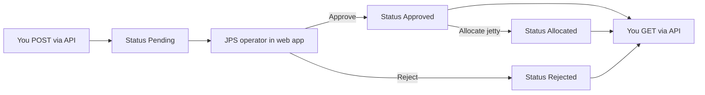

# Inbound Shipping Instruction API — Test Guide

> **Audience:** JPS developers and operators who need to test the partner integration API locally.
> **Hand off to external developers:** Use [INBOUND-SHIPPING-INSTRUCTION-PARTNER-API.md](./INBOUND-SHIPPING-INSTRUCTION-PARTNER-API.md) (v3.0) — it includes the full API contract, **staging environment**, and self-service test walkthrough.

---

## 1. What you are testing

You simulate an **external system** (ERP, agency software, etc.) that:

1. **Submits** a Shipping Instruction to JPS (`POST`)
2. **Polls** for review status (`GET`)
3. **Observes** the lifecycle: `Pending` → `Approved` / `Rejected` → `Allocated`

The operator review (approve, reject, allocate a jetty) happens in the normal JPS web app — that is how you complete the end-to-end test.



---

## 2. Prerequisites

### 2.1 Backend running

**Docker (recommended):**

```powershell
cd Backend
docker compose up -d --build
```

| Service | URL |
|---------|-----|
| API | `http://localhost:3000` |
| Health check | `http://localhost:3000/api/v1/health` |
| Frontend (optional, for operator steps) | `http://localhost:5173` |

Open the health URL in a browser. You should see JSON like `{ "status": "ok", ... }`.

### 2.2 Database migration

The integration API needs migration `084`. Run once (or after pulling new migrations):

```powershell
docker exec jps-api npm run migrate
```

You should see `Applying migration: 084_integration_partner_api.sql` if it had not been applied yet.

### 2.3 API key

Each test partner needs an API key. Create one inside the API container:

```powershell
docker exec jps-api node scripts/create-integration-api-key.mjs --partner "MY_TEST_ERP"
```

**Copy the plaintext key immediately** — it is shown only once, for example:

```
jps_live_a73fc30df0307cf6e4a8b15be50e4373
```

Other useful commands:

```powershell
# List keys (prefix only, not the full secret)
docker exec jps-api node scripts/create-integration-api-key.mjs --list

# Revoke a key
docker exec jps-api node scripts/create-integration-api-key.mjs --deactivate 1
```

Keys are not port-scoped. Partners pass a valid `port_id` in each request payload; on a typical local dev database, port `1` is **BONTANG**.

### 2.4 Valid master data

Your test payload must use values that exist in JPS master data:

| Field | Rule |
|-------|------|
| `port_id` | Must be a valid JPS port (e.g. `1`); keys are not port-scoped |
| `cargo[].cargo_type` | Must match a commodity **short name** in JPS (case-insensitive), e.g. `CPO`, `CPKO`, `POME` |
| `cargo[].unit` | `MT` or `KL` only |
| `purpose` | `Loading` or `Unloading` |

#### Commodity mapping (`cargo_type` → JPS short name)

Send the **JPS short_name** value in `cargo_type`. Full display names are **not** accepted.

| JPS short_name (`cargo_type`) | JPS display name | Type |
|-------------------------------|------------------|------|
| `CG` | CRUDE GLYCERINE | Liquid |
| `CPKO` | CRUDE PALM KERNEL OIL | Liquid |
| `CPO` | CRUDE PALM OIL | Liquid |
| `FAME` | Fatty Acid Methyl Ester | Liquid |
| `INS POME FAD` | INS PALM OIL MILL EFFLUENT FATTY ACID DISTILLATE | Liquid |
| `INS RPOME` | INS REFINED PALM OIL MILL EFFLUENT | Liquid |
| `ISCC POMEPFAD` | ISCC PALM OIL MILL EFFLUENT FATTY ACID DISTILLATE (POMEPFAD) | Liquid |
| `ISCC RPOME` | ISCC REFINED PALM OIL MILL EFFLUENT | Liquid |
| `METHANOL` | METHANOL | Liquid |
| `PFAD` | Palm Fatty Acid Distillate | Liquid |
| `PKE` | Palm Kernel Expeller | Solid |
| `PKM` | Palm Kernel Meal | Solid |
| `PKS` | Palm Kernel Shell | Solid |
| `POME` | Palm Oil Mill Effluent | Liquid |
| `RBD PO` | RBD PO | Liquid |
| `RG` | REFINED GLYCERINE | Liquid |
| `ROL` | Refined Olein | Liquid |
| `RPOME` | REFINED PALM OIL MILL EFFLUENT | Liquid |
| `SPLIT CPKO FA` | SPLIT CRUDE PALM KERNEL OIL FATTY ACID | Liquid |
| `SPLIT RBD PKO FA` | SPLIT RBD PALM KERNEL OIL FATTY ACID | Liquid |

*20 commodities as of master data export. Re-query if commodities are added or changed.*

To refresh this list from your database:

```powershell
docker exec jps-api node -e "import('pg').then(async ({default:pg})=>{const p=new pg.Pool({connectionString:process.env.DATABASE_URL});const r=await p.query('SELECT short_name, name, commodity_type FROM si_commodities WHERE deleted_at IS NULL ORDER BY short_name');r.rows.forEach(x=>console.log(x.short_name+' | '+x.name+' | '+x.commodity_type));await p.end();})"
```

If you send an unknown `cargo_type`, the API returns `400` with a list of valid short names in `valid_cargo_types` — use that list to fix your payload.

---

## 3. Base URL and auth (local)

| Item | Local value |
|------|-------------|
| Base URL | `http://localhost:3000/api/v1/integrations` |
| Auth header | `x-api-key: jps_live_...` (your key) |
| Content-Type (POST) | `application/json` |

For staging/production, replace the host with your HTTPS domain (see the [partner API guide](./INBOUND-SHIPPING-INSTRUCTION-PARTNER-API.md)).

---

## 4. Test with curl (PowerShell)

curl is built into Windows 10/11. Use `curl.exe` in PowerShell so you do not hit the `Invoke-WebRequest` alias.

### 4.1 Set variables

```powershell
$API_KEY = "jps_live_PASTE_YOUR_KEY_HERE"
$BASE    = "http://localhost:3000/api/v1/integrations"
```

### 4.2 Test 1 — Submit a shipping instruction (expect `201`)

Save a sample payload to a file (easier than inline JSON on Windows):

```powershell
@'
{
  "external_reference": "SI-TEST-001",
  "port_id": 1,
  "vessel_name": "MV TEST VESSEL",
  "voyage_no": "VY-001",
  "purpose": "Loading",
  "eta": "2026-06-20T08:00:00Z",
  "etd": "2026-06-22T18:00:00Z",
  "agent_name": "PT Test Agency",
  "agent_contact": "ops@test.example.com",
  "notes": "My first API test",
  "cargo": [
    {
      "cargo_type": "CPO",
      "description": "Main lot",
      "tonnage": 25000,
      "unit": "MT",
      "contract_no": "CTR-001"
    }
  ]
}
'@ | Set-Content -Path "$env:TEMP\si-test.json" -Encoding UTF8

curl.exe -X POST "$BASE/shipping-instructions" `
  -H "x-api-key: $API_KEY" `
  -H "Content-Type: application/json" `
  --data "@$env:TEMP\si-test.json"
```

**Success response (`201`):**

```json
{
  "success": true,
  "data": {
    "id": 41,
    "external_reference": "SI-TEST-001",
    "status": "Pending",
    "vessel_name": "MV TEST VESSEL",
    "port_id": 1,
    "received_at": "2026-06-12T08:49:12.525Z"
  }
}
```

**Save the `id`** from `data.id` — you need it for the next step.

> Use a **new** `external_reference` (e.g. `SI-TEST-002`) for each new submission. Reusing the same reference returns `409 DUPLICATE_REFERENCE`.

### 4.3 Test 2 — Check status by id (expect `200`, status `Pending`)

Replace `41` with your id:

```powershell
curl.exe "$BASE/shipping-instructions/41" -H "x-api-key: $API_KEY"
```

### 4.4 Test 3 — Check status by external reference

Useful if you lost the id:

```powershell
curl.exe "$BASE/shipping-instructions?external_reference=SI-TEST-001" -H "x-api-key: $API_KEY"
```

### 4.5 Test 4 — Duplicate submission (expect `409`)

Run the same `POST` from Test 1 again without changing `external_reference`:

```powershell
curl.exe -X POST "$BASE/shipping-instructions" `
  -H "x-api-key: $API_KEY" `
  -H "Content-Type: application/json" `
  --data "@$env:TEMP\si-test.json"
```

Expected: `"code": "DUPLICATE_REFERENCE"` and `details.existing_id` pointing to the original submission.

### 4.6 Test 5 — Invalid API key (expect `401`)

```powershell
curl.exe "$BASE/shipping-instructions/41" -H "x-api-key: jps_live_wrong"
```

Expected: `"code": "INVALID_API_KEY"`.

### 4.7 Test 6 — Unknown port (expect `400`)

Copy the JSON file, change `"port_id": 1` to `"port_id": 99` (a port that does not exist), and use a new `external_reference` (e.g. `SI-TEST-003`):

```powershell
curl.exe -X POST "$BASE/shipping-instructions" `
  -H "x-api-key: $API_KEY" `
  -H "Content-Type: application/json" `
  --data "@$env:TEMP\si-bad-port.json"
```

Expected: `"code": "VALIDATION_ERROR"` with an `unknown port` issue in `details`.

### 4.8 Test 7 — Unknown cargo type (expect `400`)

Use `"cargo_type": "FAKE_CARGO"` and a new `external_reference`:

Expected: `"code": "VALIDATION_ERROR"` with `valid_cargo_types` in `details`.

---

## 5. Test with Postman (visual)

Postman is a free desktop app for building and saving HTTP requests without typing curl.

### 5.1 Install and setup

1. Download from [postman.com/downloads](https://www.postman.com/downloads/).
2. Create a **Collection** named `JPS Integration API`.
3. Open the collection → **Variables** tab:

| Variable | Initial value |
|----------|---------------|
| `baseUrl` | `http://localhost:3000/api/v1/integrations` |
| `apiKey` | your `jps_live_...` key |
| `siId` | leave empty; fill after first POST |

### 5.2 Request: Submit shipping instruction

| Setting | Value |
|---------|-------|
| Method | `POST` |
| URL | `{{baseUrl}}/shipping-instructions` |
| Headers | `x-api-key`: `{{apiKey}}`, `Content-Type`: `application/json` |
| Body | raw → JSON — paste the sample from section 4.2 |

Click **Send**. Status should be `201 Created`. Copy `data.id` into the collection variable `siId`.

### 5.3 Request: Get status by id

| Setting | Value |
|---------|-------|
| Method | `GET` |
| URL | `{{baseUrl}}/shipping-instructions/{{siId}}` |
| Headers | `x-api-key`: `{{apiKey}}` |

Click **Send**. Status should be `200 OK`, `"status": "Pending"`.

### 5.4 Request: Get status by external reference

| Setting | Value |
|---------|-------|
| Method | `GET` |
| URL | `{{baseUrl}}/shipping-instructions?external_reference=SI-TEST-001` |
| Headers | `x-api-key`: `{{apiKey}}` |

Duplicate these three requests in the collection to build a reusable test suite for your team.

---

## 6. Simulate the operator side (full lifecycle)

The API only submits and reads status. To see `Approved` or `Allocated`, an operator must act in JPS:

| Step | Where | Action |
|------|-------|--------|
| 1 | API (`POST`) | Submit instruction → status `Pending` |
| 2 | JPS web app | Log in → open **Shipment Plans** / approval queue |
| 3 | JPS web app | Find **MV TEST VESSEL** (or reference `SI-TEST-001`) |
| 4 | JPS web app | **Approve** or **Reject** the plan |
| 5 | API (`GET`) | Confirm status is `Approved` or `Rejected` |
| 6 | JPS web app | If approved → **Allocation** → assign jetty/berth |
| 7 | API (`GET`) | Confirm status is `Allocated` and `allocation.jetty_name` is set |

### Expected status after each stage

| Stage | GET `status` | Notable fields |
|-------|--------------|----------------|
| Just submitted | `Pending` | `allocation: null`, `rejection_reason: null` |
| Operator approved | `Approved` | `allocation: null` |
| Jetty assigned | `Allocated` | `allocation.jetty_name`, `allocation.planned_berthing_time` |
| Operator rejected | `Rejected` | `rejection_reason` populated |

Poll every few minutes in real integrations — operator review is a human process, not instant.

---

## 7. Reading responses

### Success envelope

```json
{ "success": true, "data": { ... } }
```

### Error envelope

```json
{
  "success": false,
  "error": {
    "code": "VALIDATION_ERROR",
    "message": "Payload validation failed",
    "details": [ { "field": "eta", "issue": "required" } ]
  },
  "request_id": "req_abc123"
}
```

Always note `request_id` when reporting failures — it helps trace the request in server logs.

### HTTP status reference

| HTTP | Error code | Meaning |
|------|------------|---------|
| `201` | — | Instruction created |
| `200` | — | Status retrieved |
| `400` | `VALIDATION_ERROR` | Fix the JSON payload |
| `401` | `INVALID_API_KEY` | Missing or wrong `x-api-key` |
| `404` | `NOT_FOUND` | Unknown id or reference (or not yours) |
| `409` | `DUPLICATE_REFERENCE` | Same `external_reference` already submitted |
| `429` | `RATE_LIMITED` | Over 120 requests/minute — wait and retry |
| `500` | `INTERNAL_ERROR` | Server error — retry with backoff |

---

## 8. First-session checklist

- [ ] Backend up — `http://localhost:3000/api/v1/health` returns OK
- [ ] Migration `084` applied — `docker exec jps-api npm run migrate`
- [ ] API key created and saved — `create-integration-api-key.mjs`
- [ ] `POST` with valid payload → `201`, status `Pending`, note the `id`
- [ ] `GET` by id → `200`, status `Pending`
- [ ] Duplicate `POST` → `409 DUPLICATE_REFERENCE`
- [ ] Bad key → `401 INVALID_API_KEY`
- [ ] Plan visible in JPS web app (Shipment Plans / approval)
- [ ] Approve in UI → `GET` shows `Approved`
- [ ] Allocate jetty in UI → `GET` shows `Allocated`

---

## 9. Common mistakes

| Symptom | Likely cause | Fix |
|---------|--------------|-----|
| `401 INVALID_API_KEY` | Missing/wrong header | Add `-H "x-api-key: jps_live_..."` |
| `400` unknown port | `port_id` is not a valid JPS port | Use a real `port_id` (e.g. `1` on staging) |
| `400` unknown cargo | Typo in `cargo_type` or full name instead of short code | Use commodity short name from §2.4 mapping table or `valid_cargo_types` in the error |
| `409 DUPLICATE_REFERENCE` | Reused `external_reference` | Change to a new reference for each test |
| Status stuck on `Pending` | No operator action yet | Approve/reject in JPS web app |
| Status never `Allocated` | No jetty assigned | Complete allocation in JPS after approval |
| Connection refused | API not running | `docker compose up -d` in `Backend/` |

---

## 10. Troubleshooting

### API container not starting after code changes

Rebuild and restart:

```powershell
cd Backend
docker compose up -d --build
docker exec jps-api npm run migrate
```

### Check API logs

```powershell
docker logs jps-api --tail 50
```

### Verify integration tables exist

```powershell
docker exec jps-api node -e "import('pg').then(async ({default:pg})=>{const p=new pg.Pool({connectionString:process.env.DATABASE_URL});const r=await p.query(`SELECT to_regclass('integration_api_keys'), to_regclass('integration_submissions')`);console.log(r.rows[0]);await p.end();})"
```

Both columns should show table names, not `null`.

---

## 11. Related files

| File | Purpose |
|------|---------|
| [INBOUND-SHIPPING-INSTRUCTION-PARTNER-API.md](./INBOUND-SHIPPING-INSTRUCTION-PARTNER-API.md) | Full API contract for external partners |
| [Backend/scripts/create-integration-api-key.mjs](../../Backend/scripts/create-integration-api-key.mjs) | Create/list/revoke API keys |
| [Backend/src/routes/integrations.js](../../Backend/src/routes/integrations.js) | Route implementation |
| [Backend/migrations/084_integration_partner_api.sql](../../Backend/migrations/084_integration_partner_api.sql) | Database schema |

---

## Document history

| Version | Date | Notes |
|---------|------|-------|
| 1.0 | 2026-06-12 | Initial test guide: curl, Postman, operator lifecycle, checklist |

